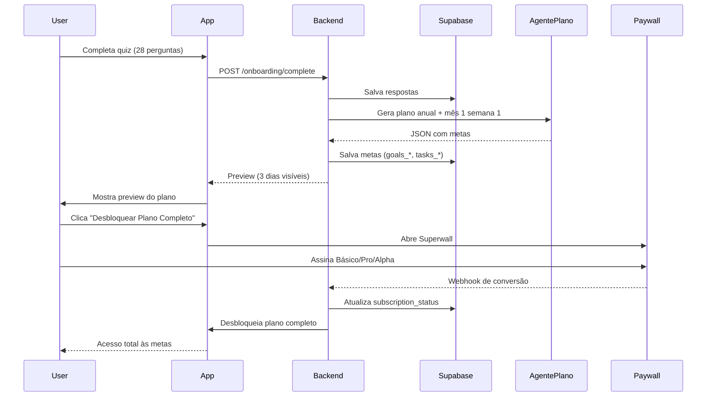
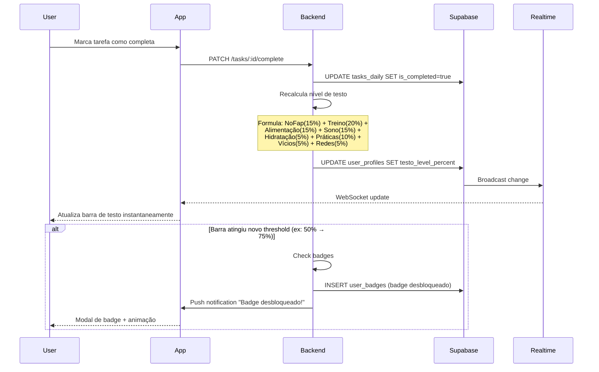
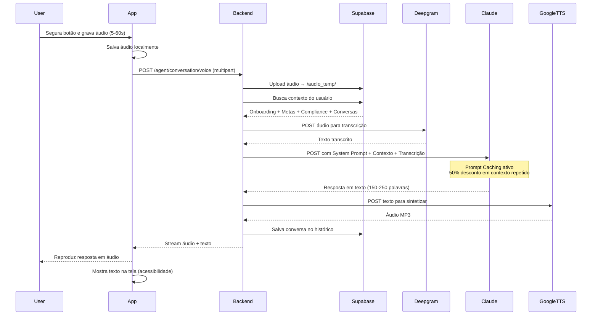
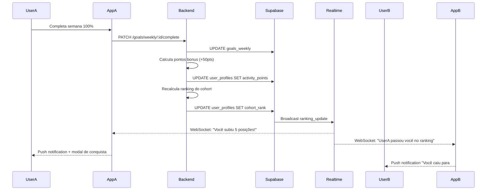

# ARQUITETURA DE SISTEMA - ANTIBETA

**Documento de Arquitetura Técnica**  
**Versão:** 1.0  
**Data:** Fevereiro 2025  
**Autor:** NEO - Agente Especialista em Documentação Técnica

---

## ÍNDICE

1. [Visão Geral](#1-visão-geral)
2. [Arquitetura de Alto Nível](#2-arquitetura-de-alto-nível)
3. [Stack Tecnológica](#3-stack-tecnológica)
4. [Componentes do Sistema](#4-componentes-do-sistema)
5. [Fluxos de Dados Críticos](#5-fluxos-de-dados-críticos)
6. [Sistema Multi-Agente de IA](#6-sistema-multi-agente-de-ia)
7. [Infraestrutura e Deploy](#7-infraestrutura-e-deploy)
8. [Segurança e Autenticação](#8-segurança-e-autenticação)
9. [Escalabilidade](#9-escalabilidade)
10. [Monitoramento e Observabilidade](#10-monitoramento-e-observabilidade)

---

## 1. VISÃO GERAL

### 1.1 Propósito do Sistema

O **Antibeta** é um aplicativo mobile de desenvolvimento masculino gamificado que utiliza IA para criar planos personalizados de transformação física, mental e social. O sistema combina tracking de hábitos, agentes conversacionais, análise comportamental e gamificação para auxiliar homens da Geração Z (19-25 anos) a desenvolverem disciplina, aumentarem testosterona e melhorarem habilidades sociais.

### 1.2 Princípios Arquiteturais

1. **Mobile-First:** Toda experiência otimizada para dispositivos móveis (iOS e Android)
2. **IA-First:** Personalização profunda através de múltiplos agentes de IA especializados
3. **Offline-First (parcial):** Metas diárias acessíveis sem conexão, sincronização ao conectar
4. **Real-time:** Atualizações instantâneas de progresso, ranking e notificações
5. **Modular:** Separação clara entre agentes de IA, backend e frontend
6. **Cost-Conscious:** Otimização de custos de IA através de caching, batching e limites por tier

### 1.3 Requisitos Não-Funcionais

| Requisito | Meta | Justificativa |
|-----------|------|---------------|
| **Disponibilidade** | 99.5% uptime | App de hábitos diários não pode ter downtime frequente |
| **Latência API** | <500ms p95 | Responsividade crítica para UX mobile |
| **Latência IA (voz)** | <2s total (STT+LLM+TTS) | Conversação precisa parecer natural |
| **Throughput** | 100 req/s (10k usuários simultâneos) | Pico matinal (7-9h) quando todos checam metas |
| **Segurança** | Dados criptografados em trânsito e repouso | LGPD/GDPR compliance |
| **Escalabilidade** | Horizontal até 100k usuários | Crescimento orgânico esperado em 12 meses |

---

## 2. ARQUITETURA DE ALTO NÍVEL

### 2.1 Diagrama de Componentes

```
┌─────────────────────────────────────────────────────────────────────┐
│                        CAMADA DE CLIENTES                            │
├─────────────────────────────────────────────────────────────────────┤
│                                                                       │
│  ┌─────────────────┐                    ┌─────────────────┐         │
│  │   iOS App       │                    │  Android App    │         │
│  │  (React Native) │                    │ (React Native)  │         │
│  │     + Expo      │                    │    + Expo       │         │
│  └────────┬────────┘                    └────────┬────────┘         │
│           │                                      │                   │
│           └──────────────────┬───────────────────┘                   │
└───────────────────────────────┼───────────────────────────────────────┘
                                │
                                │ HTTPS / WSS
                                │
┌───────────────────────────────┼───────────────────────────────────────┐
│                        CAMADA DE API                                  │
├───────────────────────────────┼───────────────────────────────────────┤
│                               │                                       │
│                   ┌───────────▼──────────┐                           │
│                   │   API Gateway        │                           │
│                   │  (NestJS + Express)  │                           │
│                   │   Railway Deploy     │                           │
│                   └───────────┬──────────┘                           │
│                               │                                       │
│           ┌───────────────────┼───────────────────┐                  │
│           │                   │                   │                  │
│  ┌────────▼────────┐ ┌────────▼────────┐ ┌───────▼────────┐         │
│  │  Auth Module    │ │  Goals Module   │ │  Tracking      │         │
│  │  (Supabase)     │ │  (Business)     │ │  Module        │         │
│  └─────────────────┘ └─────────────────┘ └────────────────┘         │
│                                                                       │
│  ┌─────────────────┐ ┌─────────────────┐ ┌────────────────┐         │
│  │  Gamification   │ │  Notifications  │ │  Analytics     │         │
│  │  Module         │ │  Module         │ │  Module        │         │
│  └─────────────────┘ └─────────────────┘ └────────────────┘         │
│                                                                       │
└───────────────────────────────────────────────────────────────────────┘
                                │
                                │
┌───────────────────────────────┼───────────────────────────────────────┐
│                    CAMADA DE SERVIÇOS DE IA                           │
├───────────────────────────────┼───────────────────────────────────────┤
│                               │                                       │
│           ┌───────────────────┼───────────────────┐                  │
│           │                   │                   │                  │
│  ┌────────▼────────┐ ┌────────▼────────┐ ┌───────▼────────┐         │
│  │   Agente de     │ │   Agente        │ │   Agente       │         │
│  │  Planejamento   │ │ Conversacional  │ │   Scanner      │         │
│  │ (Claude Haiku)  │ │ (Claude Haiku)  │ │ (Claude Haiku) │         │
│  │                 │ │                 │ │  [Fase 2]      │         │
│  │ • Onboarding    │ │ • Voz-para-Voz  │ │ • OCR análise  │         │
│  │ • Metas anuais  │ │ • Tough Love    │ │ • Temperatura  │         │
│  │ • Planos        │ │ • Contexto user │ │   beta         │         │
│  │   semanais      │ │                 │ │                │         │
│  └─────────────────┘ └─────────────────┘ └────────────────┘         │
│                                                                       │
│  ┌─────────────────────────────────────────────────────────┐         │
│  │         SERVIÇOS DE IA AUXILIARES                       │         │
│  ├─────────────────────────────────────────────────────────┤         │
│  │  • Deepgram STT (Speech-to-Text)                        │         │
│  │  • Google Cloud TTS Neural2 PT-BR (Text-to-Speech)     │         │
│  │  • Google Cloud Vision API (OCR - Fase 2)              │         │
│  └─────────────────────────────────────────────────────────┘         │
│                                                                       │
└───────────────────────────────────────────────────────────────────────┘
                                │
                                │
┌───────────────────────────────┼───────────────────────────────────────┐
│                    CAMADA DE DADOS E STORAGE                          │
├───────────────────────────────┼───────────────────────────────────────┤
│                               │                                       │
│  ┌────────────────────────────▼──────────────────────────┐           │
│  │              Supabase (PostgreSQL)                     │           │
│  ├────────────────────────────────────────────────────────┤           │
│  │  • users, user_profiles, user_onboarding              │           │
│  │  • goals_annual, goals_monthly, goals_weekly, daily   │           │
│  │  • tasks_daily, workouts, meals, testo_practices      │           │
│  │  • badges, user_badges, ranking, cohorts              │           │
│  │  • conversations, agent_tips, daily_quiz_responses    │           │
│  │  • Auth integrada (Supabase Auth)                     │           │
│  │  • Row Level Security (RLS) habilitado                │           │
│  └────────────────────────────────────────────────────────┘           │
│                                                                       │
│  ┌────────────────────────────────────────────────────────┐           │
│  │           Supabase Storage (Arquivos)                  │           │
│  ├────────────────────────────────────────────────────────┤           │
│  │  • /audio_temp (áudios de conversação)                │           │
│  │  • /scanner_images (prints de conversas - Fase 2)     │           │
│  │  • /user_avatars (fotos de perfil)                    │           │
│  └────────────────────────────────────────────────────────┘           │
│                                                                       │
│  ┌────────────────────────────────────────────────────────┐           │
│  │        Supabase Realtime (WebSockets)                  │           │
│  ├────────────────────────────────────────────────────────┤           │
│  │  • Ranking updates (ao vivo)                           │           │
│  │  • Badge unlocks (notificação instantânea)             │           │
│  │  • Testo level changes                                 │           │
│  └────────────────────────────────────────────────────────┘           │
│                                                                       │
└───────────────────────────────────────────────────────────────────────┘
                                │
                                │
┌───────────────────────────────┼───────────────────────────────────────┐
│                    CAMADA DE SERVIÇOS EXTERNOS                        │
├───────────────────────────────┼───────────────────────────────────────┤
│                                                                       │
│  ┌─────────────────┐  ┌─────────────────┐  ┌─────────────────┐      │
│  │   OneSignal     │  │   Superwall     │  │   Mixpanel      │      │
│  │ (Push Notif.)   │  │   (Paywall)     │  │  (Analytics)    │      │
│  └─────────────────┘  └─────────────────┘  └─────────────────┘      │
│                                                                       │
│  ┌─────────────────┐  ┌─────────────────┐                           │
│  │  Stripe/Paddle  │  │ UsageStats API  │                           │
│  │  (Pagamentos)   │  │  (Android only) │                           │
│  └─────────────────┘  └─────────────────┘                           │
│                                                                       │
└───────────────────────────────────────────────────────────────────────┘
```

---

## 3. STACK TECNOLÓGICA

### 3.1 Frontend Mobile

| Componente | Tecnologia | Versão | Justificativa |
|------------|------------|--------|---------------|
| **Framework** | React Native | 0.73+ | Cross-platform (iOS + Android), developer velocity, comunidade ativa |
| **Build Tool** | Expo | SDK 50+ | Simplifica build iOS/Android, OTA updates, managed workflow |
| **Navegação** | React Navigation | 6.x | Padrão de mercado, performance, deep linking |
| **State Management** | Zustand | 4.x | Leve, menos boilerplate que Redux, performance |
| **Estilização** | NativeWind (Tailwind) | 4.x | Utility-first, consistência com web |
| **Áudio** | Expo AV | - | Gravação/playback de áudio para conversação |
| **Notificações** | Expo Notifications + OneSignal | - | Push local e remoto |
| **Forms** | React Hook Form | 7.x | Performance, validação, UX |
| **Data Fetching** | TanStack Query (React Query) | 5.x | Cache, retry, invalidação automática |

### 3.2 Backend

| Componente | Tecnologia | Versão | Justificativa |
|------------|------------|--------|---------------|
| **Framework** | NestJS | 10.x | Arquitetura modular, TypeScript, DI nativo, escalável |
| **Runtime** | Node.js | 20 LTS | Performance, ecossistema maduro |
| **API Style** | REST + WebSocket | - | REST para CRUD, WS para real-time (ranking, badges) |
| **Validação** | Class Validator + Class Transformer | - | Type-safe, decorators, integrado NestJS |
| **ORM** | Prisma | 5.x | Type-safe, migrações, integração Supabase |
| **Cron Jobs** | @nestjs/schedule | - | Geração de planos semanais/mensais, reset de quotas |
| **Queue** | Bull (Redis) | - | Processamento assíncrono de IA (heavy tasks) |

### 3.3 Banco de Dados e Storage

| Componente | Tecnologia | Justificativa |
|------------|------------|---------------|
| **Database** | Supabase (PostgreSQL 15) | BaaS completo, Auth integrada, Realtime, Row Level Security |
| **File Storage** | Supabase Storage | Integrado, presigned URLs, políticas de acesso |
| **Cache** | Redis (Railway add-on) | Session storage, rate limiting, Bull queues |
| **Realtime** | Supabase Realtime (WebSocket) | Ranking ao vivo, badge unlocks instantâneos |

### 3.4 Inteligência Artificial

| Componente | Tecnologia | Custo | Uso |
|------------|------------|-------|-----|
| **LLM Principal** | Claude 3.5 Haiku (Anthropic) | $0.80/MTok in, $4/MTok out | 3 agentes especializados |
| **Speech-to-Text** | Deepgram Nova-2 | $0.0043/min | Conversação por voz |
| **Text-to-Speech** | Google Cloud TTS Neural2 PT-BR | $16/1M chars | Resposta em áudio |
| **OCR (Fase 2)** | Google Cloud Vision API | $1.50/1k imgs | Scanner de conversas |
| **Prompt Caching** | Anthropic Prompt Caching | 50% desconto em tokens repetidos | Contexto do usuário |

### 3.5 Infraestrutura e DevOps

| Componente | Tecnologia | Justificativa |
|------------|------------|---------------|
| **Hosting Backend** | Railway | Deploy simplificado Node.js, escalabilidade automática |
| **Hosting Database** | Supabase Cloud | Managed PostgreSQL, backups automáticos |
| **CI/CD** | GitHub Actions | Integrado com Railway e Expo EAS |
| **Monitoring** | Railway Logs + Sentry | Erro tracking, performance monitoring |
| **Analytics** | Mixpanel | Eventos de produto, funis, cohorts |
| **Push Notifications** | OneSignal | Free tier generoso, segmentação avançada |
| **Paywall** | Superwall | A/B testing de paywalls, analytics integrado |
| **Payments** | Stripe (web) + In-App Purchase (mobile) | Compliance PCI, suporte a assinaturas |

---

## 4. COMPONENTES DO SISTEMA

### 4.1 Mobile App (React Native + Expo)

#### 4.1.1 Estrutura de Pastas

```
/src
├── /screens          # Telas principais
│   ├── /onboarding   # Quiz 28 perguntas
│   ├── /home         # Dashboard com cards de metas
│   ├── /workout      # Detalhes do treino
│   ├── /ranking      # Ranking por cohort
│   ├── /agent        # Conversação com agente
│   ├── /scanner      # Scanner de conversas (Fase 2)
│   └── /profile      # Perfil e configurações
├── /components       # Componentes reutilizáveis
│   ├── /ui           # Buttons, Cards, Inputs
│   ├── /goals        # GoalCard, ProgressBar
│   ├── /badges       # BadgeCard, BadgeModal
│   └── /notifications
├── /navigation       # Stack, Tab, Drawer navigators
├── /store            # Zustand stores
│   ├── userStore.ts
│   ├── goalsStore.ts
│   ├── rankingStore.ts
│   └── agentStore.ts
├── /services         # API clients
│   ├── api.ts        # Axios instance
│   ├── auth.ts       # Supabase Auth
│   ├── ai.ts         # IA endpoints
│   └── tracking.ts   # Usage tracking (Android)
├── /hooks            # Custom hooks
│   ├── useGoals.ts
│   ├── useRanking.ts
│   └── useAudioRecorder.ts
├── /utils            # Helpers
│   ├── testoCalculator.ts
│   ├── dateHelpers.ts
│   └── validators.ts
└── /constants        # Colors, fonts, config
```

#### 4.1.2 Principais Telas

**Home Dashboard:**
- Card de nível de testosterona (barra de progresso)
- Card de metas do dia (treino, alimentação, hidratação, práticas testo)
- Card de quiz diário (se ainda não respondido)
- Card de dica semanal/mensal
- Botão flutuante de acesso rápido ao agente conversacional

**Ranking:**
- Tabs: "Meu Cohort" | "Global"
- Top 10 destacados
- Posição do usuário
- Badges desbloqueados (galeria)

**Agente Conversacional:**
- Interface de voz (waveform animado durante gravação)
- Histórico de conversas (últimas 10)
- Botão de emergência "Preciso de ajuda agora"

**Treino:**
- Lista de exercícios com séries/reps
- Cronômetro global
- Cronômetro de descanso entre séries
- Checkboxes por exercício
- Botão "Concluir Treino" (enabled só quando todos marcados)

### 4.2 Backend (NestJS)

#### 4.2.1 Módulos Principais

**AuthModule:**
- Integração com Supabase Auth
- JWT validation middleware
- Role-based access control (usuário, admin)

**GoalsModule:**
- CRUD de metas (anual, mensal, semanal, diário)
- Geração de metas via agente de planejamento
- Cálculo de compliance
- Endpoints:
  - `POST /goals/generate-annual` (pós-onboarding)
  - `POST /goals/generate-weekly` (trigger automático)
  - `GET /goals/daily/:date`
  - `PATCH /tasks/:id/complete`

**TrackingModule:**
- Registro de conclusão de tarefas
- Cálculo de nível de testosterona
- Histórico de progresso
- Endpoints:
  - `POST /tracking/task-complete`
  - `POST /tracking/quiz-daily`
  - `GET /tracking/testo-level`

**GamificationModule:**
- Sistema de badges
- Cálculo de ranking (cohort + global)
- Pontuação de atividades
- Endpoints:
  - `GET /gamification/badges`
  - `POST /gamification/unlock-badge` (interno)
  - `GET /gamification/ranking/:cohort`

**AgentModule:**
- Conversação com agente (texto e voz)
- Pipeline STT → LLM → TTS
- Scanner de conversas (Fase 2)
- Endpoints:
  - `POST /agent/conversation/voice` (multipart upload)
  - `POST /agent/conversation/text`
  - `POST /agent/scanner/analyze` (Fase 2)
  - `GET /agent/conversation/history`

**NotificationsModule:**
- Agendamento de notificações
- Segmentação por tier de plano
- Integração OneSignal
- Endpoints:
  - `POST /notifications/schedule`
  - `POST /notifications/send-immediate`
  - `PATCH /notifications/preferences`

**AnalyticsModule:**
- Tracking de eventos (Mixpanel)
- Métricas de produto
- Funis de conversão
- Endpoints:
  - `POST /analytics/event`
  - `GET /analytics/dashboard` (admin)

#### 4.2.2 Scheduled Jobs (Cron)

```typescript
// Geração de planos semanais (Domingo 22h)
@Cron('0 22 * * 0')
async generateWeeklyPlans() {
  const activeUsers = await this.getActiveSubscribers();
  for (const user of activeUsers) {
    await this.aiService.generateWeeklyPlan(user.id);
  }
}

// Geração de planos mensais (Último dia do mês, 21h)
@Cron('0 21 L * *')
async generateMonthlyPlans() {
  const activeUsers = await this.getActiveSubscribers();
  for (const user of activeUsers) {
    await this.aiService.generateMonthlyPlan(user.id);
    await this.aiService.generateMonthlyTip(user.id);
  }
}

// Reset de quotas mensais (1º dia do mês, 00h)
@Cron('0 0 1 * *')
async resetMonthlyQuotas() {
  await this.subscriptionService.resetUsageTracking();
}

// Notificação de quiz diário (21h todos os dias)
@Cron('0 21 * * *')
async sendDailyQuizNotification() {
  const usersWithoutQuiz = await this.getUnansweredQuizUsers();
  await this.notificationService.sendBulk(usersWithoutQuiz, 'daily_quiz');
}

// Cálculo de ranking (1h da manhã todos os dias)
@Cron('0 1 * * *')
async recalculateRankings() {
  await this.gamificationService.recalculateCohortRankings();
  await this.gamificationService.recalculateGlobalRanking();
}
```

### 4.3 Sistema Multi-Agente de IA

#### 4.3.1 Agente de Planejamento

**Responsabilidades:**
- Análise do onboarding (28 perguntas)
- Geração de metas anuais
- Breakdown em metas mensais (12)
- Planejamento semanal progressivo
- Planos de treino mensal
- Planos alimentares semanais
- Feedbacks mensais

**Modelo:** Claude 3.5 Haiku  
**Prompt Caching:** Habilitado (contexto do onboarding)  
**Custo médio:** $0.43/usuário/mês

**Fluxo de Geração:**

```
1. Usuário completa onboarding
   ↓
2. Dados enviados para Agente de Planejamento
   ↓
3. Agente gera:
   - Meta ANUAL (1 objetivo macro)
   - 12 metas MENSAIS derivadas
   - Semana 1 do Mês 1 DETALHADA (7 dias)
   ↓
4. Backend salva no Supabase
   ↓
5. Preview mostrado ao usuário (3 dias visíveis)
   ↓
6. Paywall bloqueando dias 4-7
```

**Trigger de Geração Semanal:**
- Usuário completa último dia da semana N
- Cron job domingo 22h (backup)
- Gera Semana N+1 automaticamente

**Trigger de Geração Mensal:**
- Usuário completa último dia do mês N
- Cron job último dia do mês 21h (backup)
- Gera:
  - Feedback do mês N
  - Novo plano de treino mensal
  - Semana 1 do mês N+1

#### 4.3.2 Agente Conversacional

**Responsabilidades:**
- Conversação por voz (STT → LLM → TTS)
- Tom "Tough Love" humanizado
- Acesso completo ao contexto do usuário
- Análise de situações sociais
- Motivação e accountability

**Modelo:** Claude 3.5 Haiku  
**Prompt Caching:** Habilitado (contexto do usuário)  
**Custo médio:** $0.46/usuário/mês (assumindo 10 conversas)

**Pipeline Voz-para-Voz:**

```
1. Usuário grava áudio (Expo AV)
   ↓
2. Upload → Supabase Storage (/audio_temp)
   ↓
3. Backend busca áudio e transcreve (Deepgram STT)
   Custo: $0.0043/min
   ↓
4. Backend busca contexto do usuário:
   - Onboarding completo
   - Metas da semana atual
   - Compliance últimos 7 dias
   - Nível de testo atual
   - Últimas 5 conversas
   ↓
5. Envia para Claude 3.5 Haiku:
   System Prompt: "Tough Love Coach"
   Input: Contexto + Transcrição
   Output: Resposta em texto (150-250 palavras)
   ↓
6. Google Cloud TTS Neural2 PT-BR
   Voz: pt-BR-Neural2-B (masculina, grave)
   Custo: $16/1M chars
   ↓
7. Stream áudio para cliente
   ↓
8. Salvar conversa no histórico (Supabase)
```

**Limites por Tier:**
- **Básico (R$29,90):** 10 conversas/mês
- **Pro (R$39,90):** 30 conversas/mês
- **Alpha (R$49,90):** 60 conversas/mês

#### 4.3.3 Agente Scanner (Fase 2)

**Responsabilidades:**
- OCR de prints de conversas
- Análise de temperatura beta (0-10)
- Identificação de erros de subcomunicação
- Sugestão de respostas alpha
- Avaliação de interesse dela

**Modelo:** Claude 3.5 Haiku  
**OCR:** Google Cloud Vision API  
**Custo médio:** $0.02/análise

**Pipeline:**

```
1. Usuário tira screenshot de conversa
   ↓
2. Upload → Supabase Storage (/scanner_images)
   ↓
3. Google Cloud Vision API (OCR)
   Extrai texto do print
   Custo: $1.50/1k imagens
   ↓
4. Claude analisa texto extraído:
   System Prompt: "Mestre de Sedução"
   Input: Texto da conversa
   Output: JSON com análise completa
   ↓
5. Backend salva análise
   ↓
6. Push notification: "Análise pronta"
   ↓
7. Usuário visualiza na tela do Scanner
```

**Limites por Tier:**
- **Básico:** 5 análises/mês
- **Pro:** 15 análises/mês
- **Alpha:** 30 análises/mês

---

## 5. FLUXOS DE DADOS CRÍTICOS

### 5.1 Onboarding → Geração de Plano



### 5.2 Completar Tarefa Diária → Atualizar Testo



### 5.3 Conversação por Voz



### 5.4 Atualização de Ranking (Realtime)



---

## 6. SISTEMA MULTI-AGENTE DE IA

### 6.1 Separação de Responsabilidades

| Agente | Modelo | Função | Trigger | Frequência |
|--------|--------|--------|---------|------------|
| **Planejamento** | Claude Haiku | Gerar metas, planos, feedbacks | Onboarding, fim de semana/mês | Semanal/Mensal |
| **Conversacional** | Claude Haiku | Conversação voz/texto, coaching | User request | Ad-hoc |
| **Scanner** | Claude Haiku | Análise de conversas | User upload (Fase 2) | Ad-hoc |

### 6.2 Otimização de Custos de IA

#### 6.2.1 Prompt Caching (Anthropic)

**Contexto cacheado:**
- Respostas do onboarding (imutável)
- System prompts dos agentes (imutável)
- Últimas 5 conversas do usuário (TTL 5min)

**Economia:**
- 50% de desconto em tokens de input repetidos
- Reduz custo de conversação em ~40%

**Implementação:**

```typescript
// Contexto com cache
const cachedContext = {
  system: [
    {
      type: "text",
      text: AGENT_SYSTEM_PROMPT, // Cacheado
      cache_control: { type: "ephemeral" }
    }
  ],
  messages: [
    {
      role: "user",
      content: [
        {
          type: "text",
          text: JSON.stringify(user.onboarding), // Cacheado
          cache_control: { type: "ephemeral" }
        },
        {
          type: "text",
          text: userTranscription // Novo (não cacheado)
        }
      ]
    }
  ]
};
```

#### 6.2.2 Batching de Geração de Planos

Para reduzir latência e custo em horários de pico:

```typescript
// Batch API (50% desconto, processamento em até 24h)
// Usado para geração semanal em massa (Domingo 22h)
async function batchGenerateWeeklyPlans(userIds: string[]) {
  const requests = userIds.map(userId => ({
    custom_id: userId,
    params: {
      model: "claude-3-5-haiku-20241022",
      max_tokens: 4000,
      messages: [{ role: "user", content: getWeeklyPlanPrompt(userId) }]
    }
  }));

  await anthropic.messages.batches.create({ requests });
  // Processamento em background, resultado em webhook
}
```

#### 6.2.3 Rate Limiting por Tier

```typescript
// Middleware de rate limiting
@UseGuards(RateLimitGuard)
@Post('/agent/conversation/voice')
async voiceConversation(@User() user) {
  const usage = await this.getMonthlyUsage(user.id);
  const limit = TIER_LIMITS[user.subscription_tier].voice_conversations;
  
  if (usage.voice_conversations >= limit) {
    throw new ForbiddenException({
      message: 'Limite mensal atingido',
      upgrade_url: '/upgrade',
      current_usage: usage.voice_conversations,
      limit: limit
    });
  }
  
  // Processa conversação...
  await this.incrementUsage(user.id, 'voice_conversations');
}
```

---

## 7. INFRAESTRUTURA E DEPLOY

### 7.1 Railway (Backend)

**Configuração:**
```yaml
# railway.json
{
  "build": {
    "builder": "NIXPACKS",
    "buildCommand": "npm run build"
  },
  "deploy": {
    "startCommand": "npm run start:prod",
    "healthcheckPath": "/health",
    "healthcheckTimeout": 100,
    "restartPolicyType": "ON_FAILURE",
    "restartPolicyMaxRetries": 10
  },
  "scaling": {
    "minReplicas": 1,
    "maxReplicas": 5,
    "autoscaling": {
      "enabled": true,
      "cpuThreshold": 70,
      "memoryThreshold": 80
    }
  }
}
```

**Variáveis de Ambiente:**
```bash
# Database
DATABASE_URL=postgresql://...
SUPABASE_URL=https://xxx.supabase.co
SUPABASE_ANON_KEY=...
SUPABASE_SERVICE_ROLE_KEY=...

# IA Services
ANTHROPIC_API_KEY=...
DEEPGRAM_API_KEY=...
GOOGLE_CLOUD_API_KEY=...

# External Services
ONESIGNAL_APP_ID=...
ONESIGNAL_API_KEY=...
SUPERWALL_API_KEY=...
STRIPE_SECRET_KEY=...

# App Config
NODE_ENV=production
PORT=3000
JWT_SECRET=...
```

### 7.2 Supabase Cloud

**Plano:** Pro ($25/mês)

**Configuração de Backups:**
- Daily automated backups (7 dias retenção)
- Weekly backups (4 semanas retenção)
- Monthly backups (3 meses retenção)
- Point-in-time recovery habilitado

**Row Level Security (RLS):**

```sql
-- Exemplo: Usuário só pode ver suas próprias metas
CREATE POLICY "Users can view own goals"
ON goals_daily
FOR SELECT
USING (auth.uid() = user_id);

-- Usuário só pode atualizar suas próprias tasks
CREATE POLICY "Users can update own tasks"
ON tasks_daily
FOR UPDATE
USING (auth.uid() = (
  SELECT user_id FROM goals_daily WHERE id = tasks_daily.daily_goal_id
));

-- Ranking é público (qualquer usuário autenticado pode ver)
CREATE POLICY "Authenticated users can view ranking"
ON user_profiles
FOR SELECT
USING (auth.role() = 'authenticated');
```

### 7.3 Expo (Mobile)

**Build Configuration:**

```json
// app.json
{
  "expo": {
    "name": "Antibeta",
    "slug": "antibeta",
    "version": "1.0.0",
    "orientation": "portrait",
    "icon": "./assets/icon.png",
    "splash": {
      "image": "./assets/splash.png",
      "resizeMode": "contain",
      "backgroundColor": "#0A0A0A"
    },
    "updates": {
      "fallbackToCacheTimeout": 0,
      "url": "https://u.expo.dev/..."
    },
    "assetBundlePatterns": ["**/*"],
    "ios": {
      "supportsTablet": false,
      "bundleIdentifier": "com.antibeta.app",
      "buildNumber": "1.0.0",
      "infoPlist": {
        "NSMicrophoneUsageDescription": "O Antibeta precisa acessar seu microfone para conversação por voz com o agente.",
        "NSCameraUsageDescription": "O Antibeta precisa acessar sua câmera para scanner de conversas."
      }
    },
    "android": {
      "adaptiveIcon": {
        "foregroundImage": "./assets/adaptive-icon.png",
        "backgroundColor": "#0A0A0A"
      },
      "package": "com.antibeta.app",
      "versionCode": 1,
      "permissions": [
        "RECORD_AUDIO",
        "CAMERA",
        "READ_EXTERNAL_STORAGE",
        "PACKAGE_USAGE_STATS"
      ]
    },
    "plugins": [
      "expo-av",
      "expo-notifications",
      "@react-native-firebase/app",
      "expo-build-properties"
    ]
  }
}
```

**EAS Build:**

```json
// eas.json
{
  "build": {
    "development": {
      "developmentClient": true,
      "distribution": "internal"
    },
    "preview": {
      "distribution": "internal",
      "android": {
        "buildType": "apk"
      }
    },
    "production": {
      "autoIncrement": true
    }
  },
  "submit": {
    "production": {
      "ios": {
        "appleId": "...",
        "ascAppId": "...",
        "appleTeamId": "..."
      },
      "android": {
        "serviceAccountKeyPath": "./google-service-account.json",
        "track": "internal"
      }
    }
  }
}
```

---

## 8. SEGURANÇA E AUTENTICAÇÃO

### 8.1 Autenticação (Supabase Auth)

**Fluxo de Sign-Up:**

```
1. Usuário preenche email + senha no app
   ↓
2. App → Supabase Auth: signUp()
   ↓
3. Supabase envia email de confirmação
   ↓
4. Usuário clica no link de confirmação
   ↓
5. Supabase Auth cria user record
   ↓
6. Trigger PostgreSQL cria user_profile
   ↓
7. App redireciona para onboarding
```

**JWT Tokens:**
- Access Token: 1h TTL
- Refresh Token: 30 dias TTL
- Renovação automática via Supabase client

### 8.2 Autorização (RBAC)

**Roles:**
- `authenticated`: Usuário normal (todos os recursos)
- `admin`: Dashboard admin (analytics, gerenciamento de usuários)

**Guards NestJS:**

```typescript
@UseGuards(JwtAuthGuard, RolesGuard)
@Roles('admin')
@Get('/analytics/dashboard')
async getAdminDashboard() {
  // Só admins podem acessar
}
```

### 8.3 Segurança de Dados

**Em Trânsito:**
- HTTPS obrigatório (TLS 1.3)
- Certificate pinning no app mobile
- WebSocket sobre TLS (WSS)

**Em Repouso:**
- Supabase: Encriptação AES-256 nativa
- Senhas: bcrypt (cost factor 12)
- Dados sensíveis no Supabase: `pgcrypto` extension

**PII (Personally Identifiable Information):**
- Áudios de conversação: deletados após 7 dias (LGPD compliance)
- Prints de scanner: deletados após 30 dias
- Logs: não armazenam PII

### 8.4 Rate Limiting

**Por IP (DDoS Protection):**
```typescript
// 100 req/min por IP
@Throttle(100, 60)
```

**Por Usuário (Abuse Prevention):**
```typescript
// Conversações de voz: limite do tier
// APIs públicas: 1000 req/hora
```

**Por Endpoint:**
```typescript
// Geração de plano: 1 req/5min (evita spam)
@Throttle(1, 300)
@Post('/goals/generate-annual')
```

---

## 9. ESCALABILIDADE

### 9.1 Horizontal Scaling

**Backend (Railway):**
- Auto-scaling de 1 a 5 replicas baseado em CPU/RAM
- Load balancer automático

**Database (Supabase):**
- Read replicas para queries pesadas (ranking, analytics)
- Connection pooling (PgBouncer integrado)

### 9.2 Otimizações de Performance

**Caching Strategy:**

| Recurso | Cache | TTL | Razão |
|---------|-------|-----|-------|
| Metas diárias | Redis | 1h | Lidas frequentemente, mudam pouco |
| Ranking cohort | Redis | 15min | Atualizado 1x/dia via cron, lido muito |
| User profile | Redis | 30min | Usado em toda request autenticada |
| System prompts IA | Memory | Permanente | Nunca mudam |

**Database Indexes:**

```sql
-- Queries frequentes otimizadas
CREATE INDEX idx_goals_daily_user_date ON goals_daily(user_id, date);
CREATE INDEX idx_tasks_daily_goal_id ON tasks_daily(daily_goal_id);
CREATE INDEX idx_user_profiles_cohort_rank ON user_profiles(cohort_id, cohort_rank);
CREATE INDEX idx_conversations_user_created ON conversations(user_id, created_at DESC);
```

**API Response Compression:**
```typescript
// Gzip compression para respostas >1KB
app.use(compression());
```

### 9.3 Monitoramento de Gargalos

**Métricas Críticas:**
- Latência p50, p95, p99 por endpoint
- Taxa de erro (4xx, 5xx)
- Uso de CPU/RAM por réplica
- Connection pool saturation (Supabase)
- Queue depth (Bull/Redis)

**Alertas (Sentry):**
- Latência p95 > 1s em qualquer endpoint
- Taxa de erro > 1% em 5min
- Queue depth > 100 jobs pendentes
- IA API failure rate > 5%

---

## 10. MONITORAMENTO E OBSERVABILIDADE

### 10.1 Logging (Railway + Sentry)

**Structured Logs:**

```typescript
import { Logger } from '@nestjs/common';

const logger = new Logger('AgentModule');

logger.log({
  event: 'voice_conversation_started',
  userId: user.id,
  audioLength: duration,
  tier: user.subscription_tier
});

logger.error({
  event: 'ai_api_error',
  userId: user.id,
  provider: 'anthropic',
  error: error.message,
  statusCode: error.response?.status
});
```

**Retention:**
- Railway Logs: 7 dias (desenvolvimento)
- Sentry: 90 dias (produção)
- CloudWatch (opcional): 1 ano (analytics de longo prazo)

### 10.2 Error Tracking (Sentry)

**Configuração:**

```typescript
import * as Sentry from '@sentry/node';

Sentry.init({
  dsn: process.env.SENTRY_DSN,
  environment: process.env.NODE_ENV,
  tracesSampleRate: 0.1, // 10% das transações
  beforeSend(event, hint) {
    // Remove PII antes de enviar
    if (event.user) {
      delete event.user.email;
      delete event.user.ip_address;
    }
    return event;
  }
});
```

**Contexto Adicional:**

```typescript
Sentry.setContext('user_tier', {
  subscription: user.subscription_tier,
  usage_this_month: usage
});

Sentry.addBreadcrumb({
  category: 'ai',
  message: 'Claude API called',
  level: 'info',
  data: { model: 'claude-3-5-haiku', tokens: 1500 }
});
```

### 10.3 Analytics (Mixpanel)

**Eventos Críticos:**

```typescript
// Onboarding
mixpanel.track('onboarding_started');
mixpanel.track('onboarding_completed', {
  duration_seconds: elapsed,
  questions_answered: 28
});

// Conversão
mixpanel.track('paywall_viewed', {
  source: 'onboarding_preview',
  tier_selected: 'basico'
});
mixpanel.track('subscription_purchased', {
  tier: 'basico',
  price: 29.90,
  period: 'monthly'
});

// Engagement
mixpanel.track('daily_goals_viewed');
mixpanel.track('task_completed', {
  task_type: 'workout',
  time_to_complete_minutes: 45
});
mixpanel.track('voice_conversation_started');
mixpanel.track('badge_unlocked', {
  badge_id: 'semana_de_honra',
  rarity: 'comum'
});

// Retention
mixpanel.track('daily_active_user');
mixpanel.track('weekly_plan_generated');
```

**Funis:**

```typescript
// Funil de Conversão
1. onboarding_started
2. onboarding_completed
3. paywall_viewed
4. subscription_purchased

// Funil de Engajamento
1. daily_goals_viewed
2. task_started
3. task_completed
4. daily_quiz_answered
```

**Cohort Analysis:**

```typescript
// Segmentação por cohort de início
mixpanel.people.set({
  $name: user.name,
  cohort: user.cohort_id,
  signup_date: user.created_at,
  subscription_tier: user.subscription_tier
});

// Retenção D7, D30
mixpanel.track('retention_d7', {
  cohort: user.cohort_id,
  active: true
});
```

---

## ANEXOS

### A. Estimativa de Custos Operacionais (1k, 10k, 50k usuários)

Referência completa da análise de custo já realizada anteriormente:

| Escala | Custo Total/mês | Custo por User | Margem (assumindo 70% mensal, 30% anual) |
|--------|-----------------|----------------|-------------------------------------------|
| 1k users | $1,611 | $1.61 | 70% ($3,789 lucro) |
| 10k users | $15,839 | $1.58 | 71% ($38,161 lucro) |
| 50k users | $80,597 | $1.61 | 70% ($189,403 lucro) |

### B. Checklist de Segurança

- [ ] HTTPS obrigatório em todas as requisições
- [ ] Row Level Security (RLS) habilitado no Supabase
- [ ] JWT tokens com expiração curta (1h)
- [ ] Refresh tokens rotacionados
- [ ] Rate limiting por IP e por usuário
- [ ] Validação de input em todas as APIs
- [ ] Sanitização de dados antes de salvar no DB
- [ ] Logs não contêm PII
- [ ] Áudios deletados após 7 dias (LGPD)
- [ ] Criptografia de dados sensíveis em repouso
- [ ] Certificate pinning no app mobile
- [ ] Webhooks de pagamento validados (HMAC)
- [ ] Admin endpoints protegidos por RBAC
- [ ] Penetration testing antes do lançamento

### C. Roadmap de Otimizações Futuras

**Curto Prazo (3-6 meses):**
- Implementar CDN para assets estáticos
- Batch processing de geração de planos (Anthropic Batch API)
- Self-hosted TTS (Coqui/Piper) para reduzir custo

**Médio Prazo (6-12 meses):**
- Read replicas no Supabase para queries de ranking
- Fine-tuning de modelo próprio (Llama 3.1 70B)
- Migração de Railway para AWS ECS (maior controle)

**Longo Prazo (12+ meses):**
- Edge computing para latência sub-100ms
- Self-hosted LLM (redução de 60-80% custo IA)
- Data warehouse para analytics avançado (ClickHouse/BigQuery)

---

**Documento criado por NEO - Agente Especialista em Documentação Técnica**  
**Antibeta © 2025 - Sistema Multi-Agente de Desenvolvimento Masculino**
